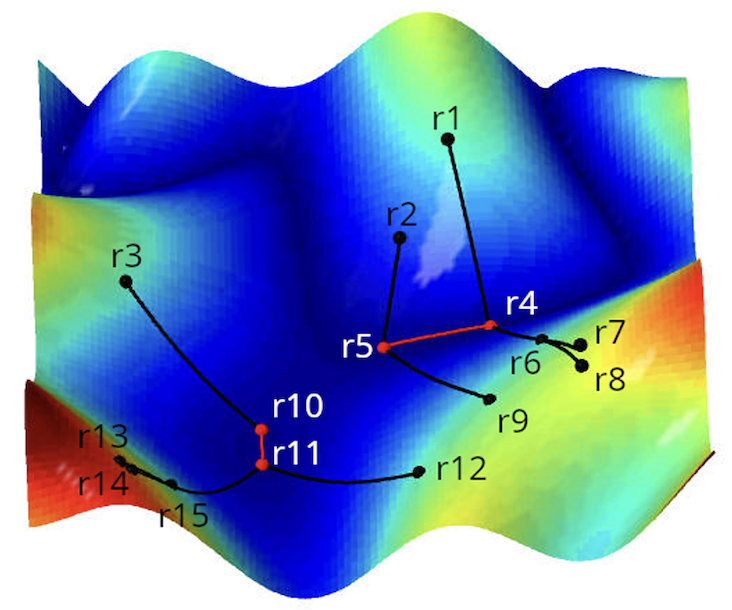

# TransitiveMaximalCorrelation

This is an R package for computing the **Transitive Maximal Correlation (TMC)** matrix from a bivariate correlation matrix and identifying the attractor pairs and attractor basins of the associated connectivity terrain. For details, see the paper "A mathematical framework for recovering functional properties in brain networks" by Hassan Abdallah, Vaibhav Diwadkar, John Kopchik, and Andrew Salch. 

---

## Installation

You can install the package directly from GitHub using:

```r
# If not already installed
install.packages("devtools")

devtools::install_github("hassan-abdallah/TransitiveMaximalCorrelation")

```

## Usage Example

Here is an example using the 15x15 bivariate correlation matrix from Figure 1 of the above paper. The connectivity terrain representation of that bivariate correlation matrix, also found in Figure 1, is:

<p align="center">



```r
library(TransitiveMaximalCorrelation)

cor_mat <- matrix(c(
  1.0, 0.3, 0.4, 0.9, 0.9, 0.9, 0.9, 0.9, 0.9, 0.3, 0.4, 0.3, 0.3, 0.3, 0.3,
  0.3, 1.0, 0.4, 0.9, 0.9, 0.9, 0.9, 0.9, 0.9, 0.3, 0.4, 0.3, 0.3, 0.3, 0.3,
  0.4, 0.4, 1.0, 0.3, 0.3, 0.3, 0.3, 0.3, 0.3, 0.9, 0.9, 0.9, 0.9, 0.9, 0.9,
  0.9, 0.9, 0.3, 1.0, 1.0, 0.9, 0.9, 0.9, 0.9, 0.3, 0.3, 0.3, 0.3, 0.3, 0.3,
  0.9, 0.9, 0.3, 1.0, 1.0, 0.9, 0.9, 0.9, 0.9, 0.3, 0.3, 0.3, 0.3, 0.3, 0.3,
  0.9, 0.9, 0.3, 0.9, 0.9, 1.0, 0.3, 0.3, 0.3, 0.3, 0.3, 0.3, 0.3, 0.3, 0.3,
  0.9, 0.9, 0.3, 0.9, 0.9, 0.3, 1.0, 0.3, 0.3, 0.3, 0.3, 0.3, 0.3, 0.3, 0.3,
  0.9, 0.9, 0.3, 0.9, 0.9, 0.3, 0.3, 1.0, 0.3, 0.3, 0.3, 0.3, 0.3, 0.3, 0.3,
  0.9, 0.9, 0.3, 0.9, 0.9, 0.3, 0.3, 0.3, 1.0, 0.3, 0.3, 0.3, 0.3, 0.3, 0.3,
  0.3, 0.3, 0.9, 0.3, 0.3, 0.3, 0.3, 0.3, 0.3, 1.0, 1.0, 0.9, 0.9, 0.9, 0.9,
  0.4, 0.4, 0.9, 0.3, 0.3, 0.3, 0.3, 0.3, 0.3, 1.0, 1.0, 0.9, 0.9, 0.9, 0.9,
  0.3, 0.3, 0.9, 0.3, 0.3, 0.3, 0.3, 0.3, 0.3, 0.9, 0.9, 1.0, 0.3, 0.3, 0.3,
  0.3, 0.3, 0.9, 0.3, 0.3, 0.3, 0.3, 0.3, 0.3, 0.9, 0.9, 0.3, 1.0, 0.3, 0.3,
  0.3, 0.3, 0.9, 0.3, 0.3, 0.3, 0.3, 0.3, 0.3, 0.9, 0.9, 0.3, 0.3, 1.0, 0.3,
  0.3, 0.3, 0.9, 0.3, 0.3, 0.3, 0.3, 0.3, 0.3, 0.9, 0.9, 0.3, 0.3, 0.3, 1.0
), nrow = 15, byrow = TRUE)

result <- tmc(cor_mat)
```

## Output:
```r
> result$tmc_matrix
      [,1] [,2] [,3] [,4] [,5] [,6] [,7] [,8] [,9] [,10] [,11] [,12] [,13] [,14] [,15]
 [1,]    0    0    0    1    1    0    0    0    0     0     0     0     0     0     0
 [2,]    0    0    0    1    1    0    0    0    0     0     0     0     0     0     0
 [3,]    0    0    0    0    0    0    0    0    0     1     1     0     0     0     0
 [4,]    0    0    0    1    1    0    0    0    0     0     0     0     0     0     0
 [5,]    0    0    0    1    1    0    0    0    0     0     0     0     0     0     0
 [6,]    0    0    0    1    1    0    0    0    0     0     0     0     0     0     0
 [7,]    0    0    0    1    1    0    0    0    0     0     0     0     0     0     0
 [8,]    0    0    0    1    1    0    0    0    0     0     0     0     0     0     0
 [9,]    0    0    0    1    1    0    0    0    0     0     0     0     0     0     0
[10,]    0    0    0    0    0    0    0    0    0     1     1     0     0     0     0
[11,]    0    0    0    0    0    0    0    0    0     1     1     0     0     0     0
[12,]    0    0    0    0    0    0    0    0    0     1     1     0     0     0     0
[13,]    0    0    0    0    0    0    0    0    0     1     1     0     0     0     0
[14,]    0    0    0    0    0    0    0    0    0     1     1     0     0     0     0
[15,]    0    0    0    0    0    0    0    0    0     1     1     0     0     0     0

> result$attractors
[[1]]
[1] 4 5

[[2]]
[1] 10 11

> result$attractor_basins
[[1]]
[1] 1 2 4 5 6 7 8 9

[[2]]
[1]  3 10 11 12 13 14 15
```

Each integer $i$ in the output of "attractors" and "attractor\_basins" corresponds to the region $r_i$ in the connectivity terrrain. The output shows that there are two attractor basins, with attractor pairs $r_4$,$r_5$ and $r_{10}$,$r_{11}$. This agrees with what is visually apparent in the figure. 
